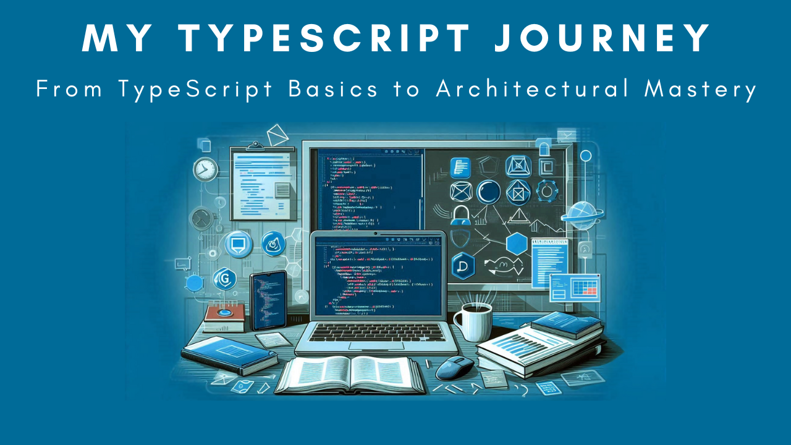

# TypeScript Learning Journey 

This repository documents my exploration of TypeScript through practical projects and exercises.

## Video Tutorial

Here is a video tutorial that complements this repository (click the image to watch the playlist):

## Learning Plan

My current focus areas include:

- Building a Fastify API server with TypeScript to handle CRUD operations using SQLite, TypeORM, and Fastify.
- Creating interactive Forms and Lists in React with TypeScript.
- Exploring and implementing concepts of Object Oriented Programming in TypeScript.

## Repository Structure

I've organized the repository into folders to clearly separate different projects and concepts:

- `01-CRUD`:  Code for the node.js console app with CRUD operations.
- `02-Fastify-API`: TypeScript Fastify API server with SQLite and TypeORM.
- `03-Forms-and-Lists`: React components for Forms and Lists.
- `04-OOP`: Exercises and examples related to Object Oriented Programming.
- ... (Additional folders will be added as I progress)

## How to Use

Each folder contains its own README with specific instructions on how to run or explore the code within.

## Feedback

I welcome feedback and suggestions as I continue to learn and improve! Feel free to open an issue or reach out.

## Disclaimer

This repository is primarily for my personal learning. While I strive for correctness, the code may not always represent best practices or production-ready solutions.
